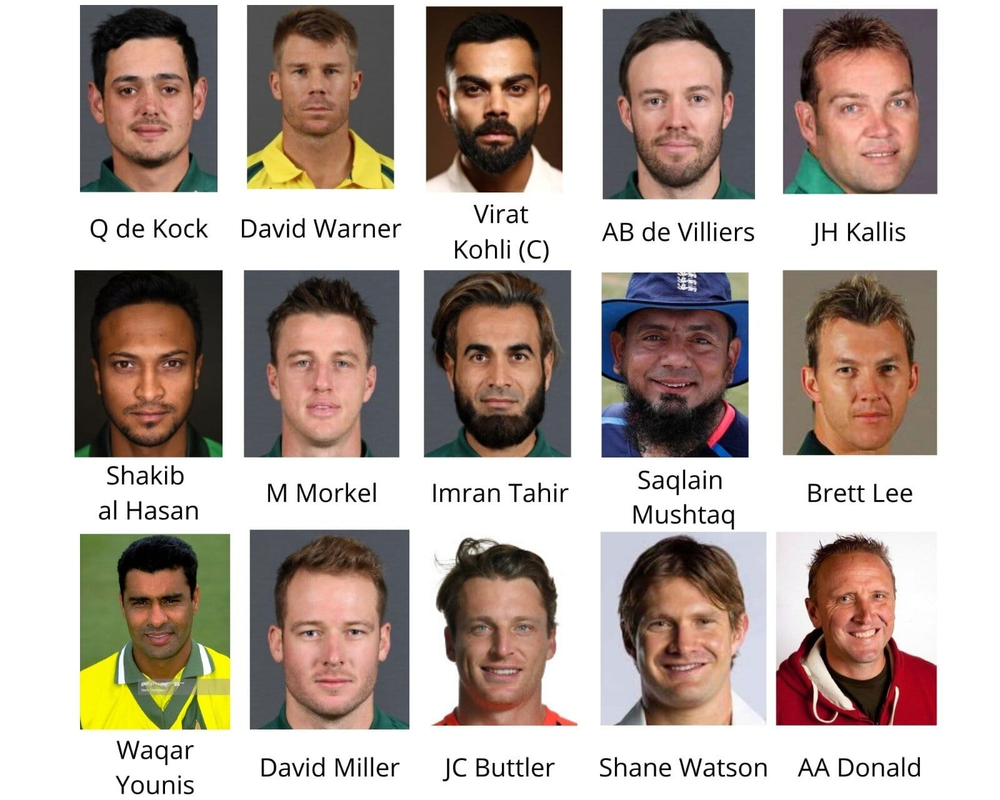

```{r setup, include=FALSE}
knitr::opts_chunk$set(echo = FALSE)
knitr::opts_chunk$set(fig.cap = "", fig.align = 'center')
```

```{r Libraries, warning=FALSE, echo=FALSE, message=FALSE}
library(tidyverse)
library(ggpubr)
library(plotly)
library(knitr)
library(gridExtra)
library(cricketdata)
library(geomnet)
library(readr)
library(rpart)
library(rpart.plot)
library(kableExtra)
```

```{r ReadData}
bat_data <- read.csv(here::here("Data/Tidy/Batting.csv"))
bowl_data <- read.csv(here::here("Data/Tidy/Bowling.csv"))
field_data <- read.csv(here::here("Data/Tidy/Fielding.csv"))
ourplayers <- read.csv(here::here("Data/ourplayers.csv"))
Captain <- read.csv(here::here("Data/Captain.csv"))
```


```{r Calculate, warning=FALSE, message=FALSE}
top_bat_data <- bat_data %>% filter(Matches>100) %>% 
   mutate(BattingQuality = (Runs/BallsFaced) * Innings,
          diff = (BattingQuality-Innings),
          Player=as.character(Player)) %>% 
          arrange(desc(diff)) %>%
          drop_na() %>% 
          rename(BattingAverage=Average,
          BattingStrikerate=StrikeRate, NetPerformance=diff)

top_bowl_data <- bowl_data %>% filter(Matches>100) %>% 
  mutate(BowlingEfficiency = Wickets/Innings,
         Player = as.character(Player))  %>%
         rename(Bowling_Average=Average,
         BowlingStrikerate=StrikeRate)

top_field_data <- field_data %>% filter(Matches>100) %>% 
  mutate(FieldingEfficiency=Dismissals/Innings,
  KeepingAbility=(Stumped+CaughtBehind)/Innings,
  Player=as.character(Player)) %>%
  mutate(WicketDismissal=(CaughtBehind+Stumped))

```


Storyboard
=====================================  

Row
-------------------------------------


### __For the Fans__

Cricket is an international sport watched throughout the world, played on every continent, with fans in every country. Internationally cricket matches are played as a series of test matches, ODI’s, T20s and World cups. ODI is a standard format which is popular and also can be useful as it is in between T20 (which has very limited balls played) and Test (which has unlimited number of balls played till all batsmen are out). Hence, our main focus will be on ODIs. So the real question is, which stats do you think are important while picking a team, COACH?

__Question: Which Batsmen should we pick?__

__Question: Which Bowlers should we pick?__

__Question: Who is going to be our Wicket Keeper?__

__Question: What about the All Rounders?__

__Question: Who will be a good Captain?__


### __Our Motivation__


In the midst of the epidemic, 4 friends started a discussion about a common sport, Cricket, with Rahul being the die-hard fan, Aarathy, a fan limited to popular opinion and social trends, Soban who only knew as much as the grapevines allowed, while Ed was hearing about it as a revelation.

Talking about this had Rahul on edge, Aarathy kept using Twitter followers and likes on photographs to tell which cricketer is better. Soban, on the other hand, used memes and grapevines to justify his choice of players in each category. Ed went through google and youtube to understand the game process and found some dataset about player stats around the world. This did not make sense to Rahul, he was using cold hard facts to support his choice but he had no output display that was very convincing to the others. Rahul had a sense of determination, knowledge of using data and a platform to make it visually appealing. He used the data set Ed found to build the best Fantasy Cricket Team, the 4 of them got invested in it like if it was a project.


Row {.tabset}
-------------------------------------

### __Cheat Sheet__


__Player:__ Contains the name of the Players.

__Start:__ Start of a player's career.

__End:__ End of a player's career, if the Player is Still playing the date will be 2020 for them.

__Matches:__ Number of matches played in an ODI career.

__Innings:__ Number of innings played in ODIs by a player 

__NotOuts:__ Number of times a batsman was NOT OUT while batting.

__Runs:__ Total number of runs made throughout the ODIs career.

__HighScore:__ Highest score a batsman has made in an ODI innings. 

__HighScoreNotOut:__ If the batsman was Not Out for the highest score they made.

__BattingAverage:__ Number of runs scored per ODI innings.

__BallsFaced:__ Total balls faced in ODIs. 

__BattingStrikerate:__ Number of runs scored per ball.

__Hundreds:__ Number of Hundreds scored in ODI innings.

__Fifties:__ Number of fifties made in ODI innings.

__Ducks:__ Number of times a batsman was dismissed without scoring a run.

__Balls:__ the number of balls bowled by a bowler in ODI career. 

__Runs:__ Number of runs the bowlers conceded to the opposing team.

__Wickets:__ Number of wickets taken by a bowler in their ODI career. 

__BowlingAverage:__ Number of runs conceded per ODI innings.

__Economy:__ Number of runs conceded per over in ODI.

__BowlingStrikerate:__ Number of runs conceded per ball. 

__BestBowlingInnings:__ The best of number of wickets taken to the number of runs conceded per innings.

__FourWickets:__ Number of Four wickets taken in a single ODI inning.

__FiveWickets:__ Number of Five wickets taken in a single ODI inning.

__Caught:__ Number of catches by fielders in ODIs. 

__CaughtBehind:__ Catches taken by the wicket keeper.

__Stumped:__ Number of wickets taken by the wicket keeper by stumping the batsman.

__MaxDismissalsInnings:__ Maximum number of wickets taken as a fielder in ODI innings.

__Dismissals:__ Number of dismissals made by a fielder in their ODI career. 

__CaughtFielder:__ Number of catches taken by the fielders. 

__FieldingEfficiency:__ Number of dismissals made by a fielder per inning.

__KeepingAbility:__ Dismissals made by the wicket keeper (stumped + caught behind) per inning of ODI. 

__BowlingEfficiency:__ Number of wickets taken per inning.

__BattingQuality:__ Runs made per ball faced in the total number of innings played by the player in the ODI.

__NetPerformance:__  Calculated by subtracting Innings from Batting Quality. To see an overall effect of a batsman on the innings is positive or negative. 


$$BowlingEfficiency = Wickets/Innings$$


$$FieldingEfficiency=Dismissals/Innings$$


$$KeepingAbility=(Stumped+CaughtBehind)/Innings$$


$$BattingQuality = (Runs/BallsFaced) * Innings$$


$$NetPerformance = BattingQuality-Innings$$

### __Analysis__ 

In Expert choice, the graphs represent the batsman, bowlers, wicket keeper and all rounders. Each Fantasy Team is as good as the reason and facts used to pick the team. The variables used by the Experts are mentioned and described in the Methodology section with reasoning as well. 

Furthermore, not all the top players were picked as represented by the graph; some variables were more important than the other. We calculated this by taking average spread upon runs made by the total number of balls played in an ODI career. Multiplied it with the number of innings played by the player, getting an inning average. And finally subtracting the total inning average by the total number of innings to see in how many innings the batsman did not perform well. An ideal player will be on the line on the origin intercept however for most graphs that was not the case and pros and cons had to be weighed to select a player. 
Similarly for bowlers we made another variable Bowling Efficiency , by dividing the total number of wickets taken in a bowlers ODI career and dividing by the number of innings played by the bowler. Used it with Economy to identify the most efficient bowler. 
For wicket keeper we focused on a batsman based wicket keeper. Using the Batting Average and another variable we calculated Keeping Ability with only dismissals made by the wicket keeper (stumped + caught behind) per innings. Clarifying efficiency of a wicket keeper with their Batting average. 
For All rounders we picked three, one being a batting all rounder meaning batting was their stronger suit and the rest of the two were Bowling all rounders. Bowling being their strong suit. We used Bowling efficiency and Batting Average to pick our allrounders. 


### __Data/How to?__

__Data__

The data used is downloaded from the R package “cricketdata” from the following link - Cricket Data Source. Data on all international cricket matches is provided by ESPNCricinfo. This package provides some scraper functions to download the data into tibbles ready for analysis. You can access all the information from ESPNcricinfo. 


__Data_Cleaning__

-The data we got had a lot of inconsistencies and missing values.

-To tidy it we separated the additional information that was provided in the name column. 

-We took out variables such as country and region to take out biases. ( it's about the player not the nationality)

-We mutated some new variables such as Batting Quality, Net Performance, Bowling efficiency, Fielding efficiency, keeping ability and wicket dismissal.

__How to?__

For picking your dream team use the drop down menu to select the stat you think is more relevant for each category of player. Get the best team you think for your One Day International Cricket. 
There are different stats specified in for batting, bowling, wicket keeping and fielding. 
Batting, Bowling and wicket keeping is the crux of the dream team fielding on the other hand is to check how overall your team is in fielding. 
If you find it hard to understand the stats displayed please use the Cheat Sheet tab.

__Expert's Choice__ these graphs have been mapped according to the joint effort of the 4 Expert's they are interactive but cannot be editted by the users. 

__Your Choice__ these graphs are purely for the users to make any graph using the varaibles provided to edit and pick their players according to what stat they deem fit for their Fantasy Cricket Team. Enjoy! 


Batsmen {data-navmenu="Pick your team"}
=====================================  


Sidebar {.sidebar}
-----------------------------------------------------------------------


```{r Batsmen}

varSelectInput("batv", label = "Choose Variable:",
             top_bat_data, selected = "BattingAverage" )
 
varSelectInput("batv2", label = "Choose Variable:",
            top_bat_data, selected = "BattingStrikerate")

```
 

Not sure about the stats and what they are? LOOK HERE : [__Cheat Sheet__](#page-1)

__Our pick__

1) Virat Kohli
2) AB de Villiers
3) JC Buttler
4) David Warner
5) David Miller

Checkout why we picked them in our Analysis [__Analysis__](#page-1)


Row
-------------------------------------


### Expert's Choice

```{r CalculateBat}

plot_bat <-  top_bat_data %>% 
  ggplot(aes(x=NetPerformance,y=BattingAverage,label=Player)) + 
  geom_point(color = "midnightblue")+ 
  geom_vline(xintercept = 0, color = "red") + theme(legend.position = "none")
  ggplotly(plot_bat)
```


### Your batsmen

```{r Bat plot}

selected_var1 <- reactive({
  sym(input$batv)
})
selected_var2 <- reactive({
  sym(input$batv2)
})
  
 renderPlotly({
    browser()
   var <- selected_var1()
     var2 <- selected_var2()
  
   p <-  ggplot(top_bat_data,aes(x=!!var,y=!!var2,label=Player)) + 
  geom_point(color="midnightblue")+ 
  geom_vline(xintercept = 0, color = "red")+theme(legend.position = "none")
  p  
}
)
```


Bowlers {data-navmenu="Pick your team"}
=====================================  

Sidebar {.sidebar}
-----------------------------------------------------------------------

```{r Bowlers}

varSelectInput("bowlv", label = "Choose Variable:",
             top_bowl_data, selected = "Bowling_Average" )
 
varSelectInput("bowlv2", label = "Choose Variable:",
            top_bowl_data, selected = "Economy")

```

Not sure about the stats and what they are? LOOK HERE : [__Cheat Sheet__](#page-1)

__Our Pick__

1) Brett Lee
2) Saqlain Mushtaq
3) Waqar Younis
4) M Morkel
5) Imran Tahir


Checkout why we picked them in our Analysis [__Analysis__](#page-1)

Row
-------------------------------------


### Expert's Choice

```{r Expert Bowlers}

plot_bowl <-  top_bowl_data %>% 
  ggplot(aes(x=BowlingEfficiency,y=Economy,label=Player)) + 
  geom_point(color = "forestgreen")+ 
  geom_vline(xintercept = 0, color = "red") + theme(legend.position = "none")
  ggplotly(plot_bowl)
  
```


### Your bowlers


```{r Your Bowler}

selected_bowlvar1 <- reactive({
  sym(input$bowlv)
})
selected_bowlvar2 <- reactive({
  sym(input$bowlv2)
})
  
 renderPlotly({
    browser()
   bowlvar <- selected_bowlvar1()
     bowlvar2 <- selected_bowlvar2()
  
   pbowl <-  ggplot(top_bowl_data,aes(x=!!bowlvar,y=!!bowlvar2,label=Player)) + 
  geom_point(color = "forestgreen")+ 
  geom_vline(xintercept = 0, color = "red")+theme(legend.position = "none")
  pbowl  
}
)
```


All rounders {data-navmenu="Pick your team"}
=====================================  

Sidebar {.sidebar}
-----------------------------------------------------------------------

```{r All rounders}
bat_bowl <- top_bat_data %>% filter(Matches>100) %>% 
  inner_join(top_bowl_data, by = "Player") %>% 
  select(Player, BowlingEfficiency, NetPerformance, BattingAverage, BattingQuality) 

bat_bowl_battingchara <- bat_bowl %>% select(Player,BattingQuality,BattingAverage)
bat_bowl_bowlingchara <- bat_bowl %>% select(Player,NetPerformance,BowlingEfficiency)

varSelectInput("batbowlv", label = "Choose Bowling Characteristic for all rounders:",
             bat_bowl_bowlingchara, selected = "NetPerformance" )
 
varSelectInput("batbowlv2", label = "Choose Batting Characteristic for all rounders:",
            bat_bowl_battingchara, selected = "BattingQuality")

top_100_field <- top_field_data %>% filter(Matches>100)

bat_field <- top_bat_data %>% filter(Matches>100) %>% 
  inner_join(top_100_field,by = "Player") %>% arrange(desc(BattingAverage))%>% 
  rename(BattingInnings=Innings.x,
         WicketInnings=Innings.y)

bat_field_battingchara <- bat_field %>% select(Player,BattingInnings,
                                               Runs,NotOuts,HighScore,
                                               HighScoreNotOut,BattingAverage,
                                               BattingStrikerate,Ducks,
                                               Hundreds,Fifties,BattingQuality,NetPerformance)

bat_field_wicketchara <- bat_field %>% select(-c(BattingInnings,
                                               Runs,NotOuts,HighScore,
                                               HighScoreNotOut,BattingAverage,
                                               BattingStrikerate,Ducks,
                                               Hundreds,Fifties,BattingQuality,NetPerformance,
                                               Start.y,End.y,Matches.y,
                                               Matches.x,Start.x,End.x))  


varSelectInput("wicketbatv", label = "Choose Keeping Characteristic for Wicket Keeper + Batsmen:",
             bat_field_wicketchara, selected = "Dismissals" )
 
varSelectInput("wicketbatv2", label = "Choose Batting Characteristic for Wicket Keeper + Batsmen:",
            bat_field_battingchara, selected = "BattingQuality")


```

Not sure about the stats and what they are? LOOK HERE : [__Cheat Sheet__](#page-1)


__NOTE:__ As a popular trend, wicket keeper is mostly a good batsman as well. For our selection we have used stats from both wicket keepers and batsman.  

__Our Pick__

1) Shakib Al Hassan

2) Shane Watson

3) JH Kallis

4) Q de Kock

Checkout why we picked them in our Analysis [__Analysis__](#page-1)


Row 
-------------------------------------


### Expert's Choice

```{r Experts all rounders, fig.height=7, fig.width=40}
plot_batbowl <- bat_bowl %>% 
  ggplot(aes(y=BattingAverage, x=BowlingEfficiency, label=Player))+
  geom_point(color="orange")+geom_vline(xintercept = 0, color="red") + theme(legend.position = "none") +
  xlab("Bowling Efficiency") +
  ylab("Batting Average")

ggplotly(plot_batbowl)

```


### Your All rounders

```{r Your all rounders, fig.height=7, fig.width=40}

selected_batbowlvar1 <- reactive({
  sym(input$batbowlv)
})
selected_batbowlvar2 <- reactive({
  sym(input$batbowlv2)
})
  
 renderPlotly({
    browser()
   batbowlvar <- selected_batbowlvar1()
     batbowlvar2 <- selected_batbowlvar2()
  
   pbatbowl <- bat_bowl %>% 
       ggplot(aes(x=!!batbowlvar,y=!!batbowlvar2,label=Player)) + 
  geom_point(color="orange")+ 
  geom_vline(xintercept = 0, color = "red")+theme(legend.position = "none")
  pbatbowl  
}
)
 
 
 
```


Column {.tabset}
----------------------------------------------


Row 
-------------------------------------

### Expert's Choice

```{r Experts choice, fig.height=7, fig.width=40}
plot_batfield <- bat_field %>% 
  ggplot(aes(y = BattingAverage, x = KeepingAbility, label = Player))+
  geom_point(color= "mediumpurple") + geom_vline(xintercept = 0, color = "red") + theme(legend.position = "none")

ggplotly(plot_batfield)
```


### Your Wicketkeeper + Batsmen

```{r Your wicket keeper + batsman, fig.height=7, fig.width=40}

selected_wicketbatvar1 <- reactive({
  sym(input$wicketbatv)
})
selected_wicketbatvar2 <- reactive({
  sym(input$wicketbatv2)
})
  
 renderPlotly({
    browser()
   wicketbatvar <- selected_wicketbatvar1()
     wicketbatvar2 <- selected_wicketbatvar2()
  
   pwicketbat <- bat_field %>% 
       ggplot(aes(x=!!wicketbatvar,y=!!wicketbatvar2,label=Player)) + 
  geom_point(color="mediumpurple")+ 
  geom_vline(xintercept = 0, color = "red")+theme(legend.position = "none")
  pwicketbat  
}
)
 
 
 
```


Wicket Keepers {data-navmenu="Pick your team"}
=====================================  

Sidebar {.sidebar}
-----------------------------------------------------------------------

```{r Wicket keeper}

wicketkeeper_characteristics <- top_field_data %>% select(Matches,Innings,
                                                          Caught,CaughtBehind,
                                                          Stumped,MaxDismissalsInnings,KeepingAbility)

varSelectInput("wicketv", label = "Choose Variable:",
            wicketkeeper_characteristics , selected = "Innings" )
 
varSelectInput("wicketv2", label = "Choose Variable:",
            wicketkeeper_characteristics, selected = "CaughtBehind")


```

Not sure about the stats and what they are? LOOK HERE : [__Cheat Sheet__](#page-1)


__NOTE__: If you want to select a wicket keeper solely on their stats for their wicket keeping career please use the dropdown menu to select. 

Row
-------------------------------------

### Expert's Choice


```{r Experts wicket keeper}

plot_wk <- top_field_data %>% filter(Stumped > 0, CaughtBehind > 0) %>% 
  ggplot(aes(x = KeepingAbility, y = Innings, label = Player))+
  geom_point(color="cornflowerblue")+
  geom_vline(xintercept = 1, color = "red")+theme(legend.position = "none")
  
ggplotly(plot_wk)
  
```


### Your wicket keepers

```{r Your wicket keeper}

selected_wicketvar1 <- reactive({
  sym(input$wicketv)
})
selected_wicketvar2 <- reactive({
  sym(input$wicketv2)
})
  
 renderPlotly({
    browser()
   wicketvar <- selected_wicketvar1()
     wicketvar2 <- selected_wicketvar2()
  
   p <- top_field_data %>% filter(Stumped > 0, CaughtBehind > 0) %>% 
       ggplot(aes(x=!!wicketvar,y=!!wicketvar2,label=Player)) + 
  geom_point(color="cornflowerblue")+ 
  geom_vline(xintercept = 1, color = "red")+theme(legend.position = "none")
  p  
}
)
 
 
 
```

Fielders {data-navmenu="Pick your team"}
=====================================  

Sidebar {.sidebar}
-----------------------------------------------------------------------


```{r Fielders}

fielder_characteristics <- top_field_data %>% select(Matches,Innings,
                                                     Dismissals,CaughtFielder,
                                                     MaxDismissalsInnings,FieldingEfficiency)
  
  

  
varSelectInput("fieldv", label = "Choose Variable:",
           fielder_characteristics, selected = "Innings" )
 
varSelectInput("fieldv2", label = "Choose Variable:",
            fielder_characteristics, selected = "Dismissals")

```

Not sure about the stats and what they are? LOOK HERE : [__Cheat Sheet__](#page-1)


__TIP__: Checkout how the players you have picked how good they are at fielding, it could be a turning point for your Fantasy team.

Row
-------------------------------------

### Expert's Choice

```{r Experts fielders}

plot_field <- top_field_data %>% filter(Stumped == 0, CaughtBehind ==0) %>% 
  ggplot(aes(x = FieldingEfficiency, y = Innings, label = Player))+
  geom_point(color="darkolivegreen4")+
  geom_vline(xintercept = 0.4, color = "red")+ theme(legend.position = "none") 
  
ggplotly(plot_field)
  
```

### Your Fielders

```{r Your fielder}

selected_fieldvar1 <- reactive({
  sym(input$fieldv)
})
selected_fieldvar2 <- reactive({
  sym(input$fieldv2)
})
  
 renderPlotly({
    browser()
   fieldvar <- selected_fieldvar1()
     fieldvar2 <- selected_fieldvar2()
  
   pf <- top_field_data %>% filter(Stumped == 0, CaughtBehind == 0) %>% 
       ggplot(aes(x=!!fieldvar,y=!!fieldvar2,label=Player)) + 
  geom_point(color="darkolivegreen4")+ 
  geom_vline(xintercept = 0.4, color = "red")+theme(legend.position = "none")
  pf  
}
)
 
 
 
```


Individual Player Stats {data-navmenu="Experts Team"}
=====================================  

Sidebar {.sidebar}
-----------------------------------------------------------------------
__Expert's Batsman Analysis__


We observe the ODI performances of the batsmen selected in our team. The point color is based on whether the batsman was OUT or NOT OUT for that particular innings. The x-axis has years and the y-axis has the number of runs the player scored for a particular match. The black line refers to the average score of the batsman from 2017 onwards.


__Expert's Bowlers Analysis__


The graph for bowlers displays the various variables we have considered to select each bowler. The variables include Economy, which must be low, Wickets which must be high, Bowling Average which must be low, and Bowling Efficiency which must be higher than 1 in ideal cases. From our selection, we can clearly see that these standards are met and thus it is verified that we have selected the best of the lot from our dataset.


__Expert's Wicket keeper Analysis__


The variables chosen for wicketkeeper are Dismissals, CaughtBehind, Stumped, and KeepingAbility all of which must be high. We can see that De Kock has lesser stats but yet beats Buttler in KeepingAbility. This is because Buttler has played far more innings as a keeper than De Kock but De Kock has better Net Performance.


Column {.tabset fig.width=100}
-------------------------------------


### Expert's Batsmen Choice


```{r Individual BatsmenPlots, echo=FALSE, fig.height=12, fig.width=8}
#Virat Kohli
vk <- fetch_player_data(253802, matchtype = "ODI", activity = "batting") %>% 
  mutate(NotOut = (Dismissal == "not out"))

vkavg <- vk %>% summarise(Innings = sum(!is.na(Runs)),
                          Average = sum(Runs, na.rm=TRUE) / (Innings - sum(NotOut, na.rm = TRUE))
                          ) %>% pull(Average)

ViratKohli <- vk %>% filter(Start_Date > "2017-01-01") %>% 
  ggplot() +
  geom_point(aes(x = Start_Date, y = Runs, color = NotOut)) +
  geom_hline(yintercept = vkavg) +
  ggtitle("Virat Kohli ODI Scores") +
  xlab("Date")

#AB de Villiers
abd <- fetch_player_data(44936, matchtype = "ODI", activity = "batting") %>% 
  mutate(NotOut = (Dismissal == "not out"))

abdavg <- abd %>% summarise(Innings = sum(!is.na(Runs)),
                          Average = sum(Runs, na.rm=TRUE) / (Innings - sum(NotOut, na.rm = TRUE))
                          ) %>% pull(Average)

ABdeVilliers <- abd %>% filter(Start_Date > "2017-01-01") %>% 
  ggplot() +
  geom_point(aes(x = Start_Date, y = Runs, color = NotOut)) +
  geom_hline(yintercept = abdavg) +
  ggtitle("AB de Villiers ODI Scores") +
  xlab("Date")

#Jos Buttler
jos <- fetch_player_data(308967, matchtype = "ODI", activity = "batting") %>% 
  mutate(NotOut = (Dismissal == "not out"))

josavg <- jos %>% summarise(Innings = sum(!is.na(Runs)),
                          Average = sum(Runs, na.rm=TRUE) / (Innings - sum(NotOut, na.rm = TRUE))
                          ) %>% pull(Average)

JosButtler <- jos %>% filter(Start_Date > "2017-01-01") %>% 
  ggplot() +
  geom_point(aes(x = Start_Date, y = Runs, color = NotOut)) +
  geom_hline(yintercept = josavg) +
  ggtitle("Jos Buttler ODI Scores") +
  xlab("Date")

#David Warner
war <- fetch_player_data(219889, matchtype = "ODI", activity = "batting") %>% 
  mutate(NotOut = (Dismissal == "not out"))

waravg <- war %>% summarise(Innings = sum(!is.na(Runs)),
                          Average = sum(Runs, na.rm=TRUE) / (Innings - sum(NotOut, na.rm = TRUE))
                          ) %>% pull(Average)

DavidWarner <- war %>% filter(Start_Date > "2017-01-01") %>% 
  ggplot() +
  geom_point(aes(x = Start_Date, y = Runs, color = NotOut)) +
  geom_hline(yintercept = waravg) +
  ggtitle("David Warner ODI Scores") +
  xlab("Date")

#David Miller
mil <- fetch_player_data(321777, matchtype = "ODI", activity = "batting") %>% 
  mutate(NotOut = (Dismissal == "not out"))

milavg <- mil %>% summarise(Innings = sum(!is.na(Runs)),
                          Average = sum(Runs, na.rm=TRUE) / (Innings - sum(NotOut, na.rm = TRUE))
                          ) %>% pull(Average)

DavidMiller <- mil %>% filter(Start_Date > "2017-01-01") %>% 
  ggplot() +
  geom_point(aes(x = Start_Date, y = Runs, color = NotOut)) +
  geom_hline(yintercept = milavg) +
  ggtitle("David Miller ODI Scores") +
  xlab("Date")

#Shane Watson
wat <- fetch_player_data(321777, matchtype = "ODI", activity = "batting") %>% 
  mutate(NotOut = (Dismissal == "not out"))

watavg <- wat %>% summarise(Innings = sum(!is.na(Runs)),
                          Average = sum(Runs, na.rm=TRUE) / (Innings - sum(NotOut, na.rm = TRUE))
                          ) %>% pull(Average)

ShaneWatson <- wat %>% filter(Start_Date > "2017-01-01") %>% 
  ggplot() +
  geom_point(aes(x = Start_Date, y = Runs, color = NotOut)) +
  geom_hline(yintercept = watavg) +
  ggtitle("Shane Watson ODI Scores") +
  xlab("Date")
```

```{r Grid1, fig.height=8, fig.width=12, warning=FALSE, echo=FALSE, message=FALSE, fig.align='center'}
grid.arrange(ViratKohli, ABdeVilliers, JosButtler, DavidWarner, DavidMiller, ShaneWatson)
```


### Expert's Bowlers

```{r Individuals BowlersPlots, echo=FALSE}
#Eonomies
econ <- top_bowl_data %>% dplyr::filter(Player %in% c("B Lee ", "Saqlain Mushtaq ", "AA Donald 	","Imran Tahir ", "M Morkel ", "Waqar Younis ", "JH Kallis ", "Shakib Al Hasan ")) %>%
  ggplot(aes( x = Player, y = Economy )) +
  geom_bar(stat = "identity", fill = "deepskyblue3") +
  theme(axis.text.x = element_text(hjust = 1)) + coord_flip()

#Wickets
wkts <- top_bowl_data %>% dplyr::filter(Player %in% c("B Lee ", "Saqlain Mushtaq ", "AA Donald 	","Imran Tahir ", "M Morkel ", "Waqar Younis ", "JH Kallis ", "Shakib Al Hasan ")) %>%
  ggplot(aes( x = Player, y = Wickets )) +
  geom_bar(stat = "identity", fill = "brown") +
  theme(axis.text.x = element_text(hjust = 1)) + coord_flip()

#BowlingAverage
bowlavg <- top_bowl_data %>% dplyr::filter(Player %in% c("B Lee ", "Saqlain Mushtaq ", "AA Donald 	","Imran Tahir ", "M Morkel ", "Waqar Younis ", "JH Kallis ", "Shakib Al Hasan ")) %>%
  ggplot(aes( x = Player, y = Bowling_Average)) +
  geom_bar(stat = "identity", fill = "forestgreen") +
  theme(axis.text.x = element_text(hjust = 1)) + coord_flip()

#BowlingEfficiency
bowlef <- top_bowl_data %>% dplyr::filter(Player %in% c("B Lee ", "Saqlain Mushtaq ", "AA Donald 	","Imran Tahir ", "M Morkel ", "Waqar Younis ", "JH Kallis ", "Shakib Al Hasan ")) %>%
  ggplot(aes( x = Player, y = BowlingEfficiency)) +
  geom_bar(stat = "identity", fill = "orange") +
  theme(axis.text.x = element_text(hjust = 1)) + coord_flip()
```

```{r Grid2,warning=FALSE, echo=FALSE, message=FALSE, fig.align='center', fig.height=12, fig.width=12}
grid.arrange(econ, wkts, bowlavg, bowlef)
```


### Expert's Keepers


```{r individual KeepersPlots, echo=FALSE, message=FALSE, warning=FALSE}
#dismissals
keepdismissal <- top_field_data %>% dplyr::filter(Player %in% c("Q de Kock ", "JC Buttler ")) %>%
  ggplot(aes( x = Player, y = Dismissals)) +
  geom_bar(stat = "identity", fill = "deepskyblue3") +
  theme(axis.text.x = element_text(hjust = 1)) + coord_flip()

#keepcaught
keepcaught <- top_field_data %>% dplyr::filter(Player %in% c("Q de Kock ", "JC Buttler ")) %>%
  ggplot(aes( x = Player, y = CaughtBehind)) +
  geom_bar(stat = "identity", fill = "brown") +
  theme(axis.text.x = element_text(hjust = 1)) + coord_flip()

#keepstump
keepstump <- top_field_data %>% dplyr::filter(Player %in% c("Q de Kock ", "JC Buttler ")) %>%
  ggplot(aes( x = Player, y = Stumped)) +
  geom_bar(stat = "identity", fill = "forestgreen") +
  theme(axis.text.x = element_text(hjust = 1)) + coord_flip()

#keepability
keepability <- top_field_data %>% dplyr::filter(Player %in% c("Q de Kock ", "JC Buttler ")) %>%
  ggplot(aes( x = Player, y = KeepingAbility)) +
  geom_bar(stat = "identity", fill = "orange") +
  theme(axis.text.x = element_text(hjust = 1)) + coord_flip()
```

```{r Grid3, warning=FALSE, echo=FALSE, message=FALSE, fig.align='center',  fig.height=12, fig.width=12}
grid.arrange(keepdismissal, keepcaught, keepstump, keepability)
```


Our Players {data-navmenu="Experts Team"}
=====================================  


Sidebar {.sidebar}
-----------------------------------------------------------------------

__Description:__ The team we have picked we cross referenced the data for which of them have performed as a Captain in their ODI career and took the win percentage to pick who is best suited for the being a Captain. 

__The names that came up__

1) Virat Kohli

2) AB de Villiers

3) Shakib Al Hassan


Colmun {fig.width=500}
-----------------------------------

### Expert's List


```{r}
 
ourplayers %>% 
 kable() %>%
kable_styling(bootstrap_options = c("striped", "hover", "condensed", "responsive"), full_width = T)%>% 
  column_spec(1,background = "lightblue") %>%
  column_spec(2,background = "lightpink") %>% 
  column_spec(3,background = "lightgreen") 

```


Row {fig.width=500 fig.height=750}
-------------------------------------

__PLACE A NAME ON A FACE__

```{r, out.width="100%"}


```


Captain {data-navmenu="Experts Team"}
===================================== 


Sidebar {.sidebar}
-----------------------------------------------------------------------

__Tweety__ 
This is a popularity Contest for the team we have finalized. We got their twitter data. We are not looking into which athlete has the most followers but we are looking into who is the most followed athlete inside the team. Meaning who is followed by their colleagues. So it's a popularity contest amongst the team. 


Row
--------

```{r Captain, fig.height=4, fig.width=10}
Captain %>%
  ggplot(aes( x = Player, y = Win.Percentage)) +
  geom_bar(stat = "identity", fill = "seagreen") +
  theme(axis.text.x = element_text(hjust = 1)) + coord_flip()
```


```{r ReadTwitterData, echo=FALSE, message=FALSE, warning=FALSE}

followinglist <- read_csv("Data/followinglist.csv")
```

```{r Network, echo=FALSE, message=FALSE, warning=FALSE}
listfollowing <- followinglist %>% select(user,user_id,screen_name) 
network <- listfollowing %>% select(user,screen_name) %>% filter(screen_name %in% c("imVkohli","ABdeVilliers17","josbuttler","davidwarner31","DavidMillerSA12","BrettLee_58
","Saqlain_Mushtaq","AllanDonald33","ImranTahirSA","mornemorkel65","waqyounis99","QuinnyDeKock69","Sah75official","ShaneRWatson33","jacqueskallis75"))

pop_score <- network %>% 
  group_by(screen_name) %>% count(screen_name)%>% arrange(desc(n))
```

```{r NetworkPlot, fig.width=10, fid.height= 4 , echo=FALSE}
set.seed(5556677)
pnetwork <- ggplot(data = network,
 aes(from_id = user,
 to_id = screen_name)) +
 geom_net(aes(group=user), layout.alg = "kamadakawai",
          colour = "blue",
         fiteach=T, directed = T, size = 4, linewidth = .5, arrowgap = 0.02,
           ealpha = .5, labelon = T, fontsize = 3, repel = T, 
           labelcolour = "black", arrowsize = .5, singletons = FALSE
        ,ecolour = "#154C07"
         ) +
 theme_net()

pnetwork
```


Column
---------------------


[Source : Giphy](https://media.giphy.com/media/ie8M6ieLofDiqEGiYT/giphy.gif)

__WHO IS OUR CAPTAIN?__

The ballots are in, after looking at the stats we decided to go with Virat Kohli. Even though AB de Villiers is more popular in the team.

Regression Tree {data-navmenu="Experts Team"}
===================================== 

Sidebar {.sidebar}
-----------------------------------------------------------------------
__Decision Tree__ 
From the Batting Decision Tree plot we can see that among these players, the expected BattingQuality is to be 118. If we sort players by NetPerformance, the largest proportion (32%) of these players whose NetPerformance are between -17~-10 have the average BowlingEfficiency of 84, followed by the second largest proportion(22%) of players whose NetPerformance are less than -40 and have the average BowlingEfficiency of 122.


From the Bowling Decisoin Tree plot if we can see that among these players, the expected BowlingEfficiency is to be 0.8. If sort players by economy, the largest proportion (27%) of these players whose economy are between 6~6.7 have the average BowlingEfficiency of 0.74, followed by the second largest proportion(24%) of players whose economy are greater than 3.4 and have the average BowlingEfficiency of 1.1

Column
------------

```{r decisiontree, fig.cap = "Batting Decision tree"}
library(rpart)
rbat <- rpart(BattingAverage ~ NetPerformance, data = top_bat_data)
rpart.plot(rbat, fallen.leaves = FALSE)
```

Column
------------


```{r bowlregression, fig.cap = "Bowling Decision tree"}
rbowl <- rpart(BowlingEfficiency ~ Economy, data = top_bowl_data)
rpart.plot(rbowl)

```


Methodology
===================================== 

__Methodology  __

The main objective of the analysis conducted for the cricket dataset is to select an all-time best eleven cricket team. The data is extracted from ESPN CricInfo and this makes our data reliable and legitimate. The data had some inconsistencies with Player names sometimes having their country along with names. These inconsistencies were removed by defining a function with Regular Expression that filtered out only the player names. 

The first and foremost decision to be made for player selection is to choose the specific quantifiable variables based on which the Players are selected. Some of the variables used for this were simple stats of the players. There is a bias observed in the data with some players having played more matches than others. This would mean that they have better stats compared to someone who has played lesser matches. By calculating some mathematical formulae, this bias was compensated for and made fairer for all players by using Net Performance as a decision factor. This makes our analysis more effective.

The other problem faced with this approach was that players with very fewer matches had far better Net Performance than players who have played more matches. This was solved simply by defining the minimum number of matches a player must have played for the analysis.

Once these selected players are plotted interactively, it is just a matter of picking the players with the best desirable values of the variables. It is not ideal for some variables to have high values. For example, the economy of a bowler should be ideally low since this variable measures the number of runs conceded by a bowler. Fifteen Members are picked from the entire dataset to be analysed further to see if the picks have the desired measures of the variables.

The individual player analysis compares all the players in each specific activity such as batting, bowling, wicket-keeping and also a variable that measures the ability of a player to captain his side. After conducting these analyses, the all-time best eleven cricket team along with substitutes is selected.


__Limitation of the data - __
The data has quite a few limitations, some variables cannot be quantified. Bowlers need additional variables such as spin baller or fast bowler. Which also has a direct relation on the type of pitch as well. Similarly a good batsman is also categorised according to their performance on each type of pitch. Only 2 variables are being used to determine a good cricket player in their respective field.

 


References
=====================================  

Row
-------------

Espncricinfo.com. 2020. Check Live Cricket Scores, Match Schedules, News, Cricket Videos Online | Espncricinfo.Com. [online] Available at: <https://www.espncricinfo.com/> [Accessed 24 May 2020].

Docs.ropensci.org. 2020. International Cricket Data. [online] Available at: <https://docs.ropensci.org/cricketdata/> [Accessed 24 May 2020].

Cricinfo. 2020. Records | One-Day Internationals | Individual Records (Captains, Players, Umpires) | Most Matches As Captain | Espncricinfo.Com. [online] Available at: <https://stats.espncricinfo.com/ci/content/records/283747.html> [Accessed 1 June 2020].

Rmarkdown.rstudio.com. 2020. Using Flexdashboard. [online] Available at: <https://rmarkdown.rstudio.com/flexdashboard/using.html> [Accessed 2 June 2020].


Dangermouse.net. 2020. DM's Explanation Of Cricket - Statistics. [online] Available at: <https://www.dangermouse.net/cricket/statistics.html> [Accessed 28 May 2020].

Machlis, S., 2020. How To Search Twitter With Rtweet And R. [online] InfoWorld. Available at: <https://www.infoworld.com/article/3515712/how-to-search-twitter-with-rtweet-and-r.html> [Accessed 3 June 2020].


_References_{Data-width = 800}
-------------------------------------

```{r}
knitr::write_bib(c('tidyverse', 'ggpubr', 'plotly', 'knitr', 'gridExtra', 'cricketdata', 'geomnet', 'readr', 'rtweet', 'kableExtra','rpart','rpart.plot'))
                
```
